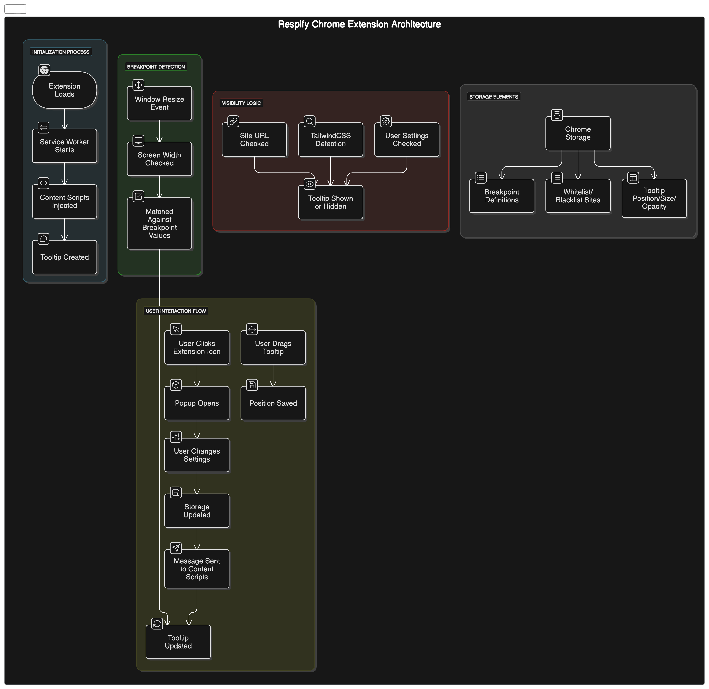

# Respify

A minimalist and effective Chrome extension that displays TailwindCSS responsive breakpoints for easy reference during development.



## Overview

Respify is a developer tool that shows the current TailwindCSS responsive breakpoint (xs, sm, md, lg, xl) in a draggable tooltip directly on your webpage. It helps front-end developers quickly identify which breakpoint is active during responsive design work.

## Features

- 📱 Real-time display of current TailwindCSS breakpoint
- 📊 Shows current screen resolution
- 🔄 Updates automatically when resizing the browser
- 🖱️ Draggable tooltip that stays where you place it
- ⚙️ Customizable tooltip size and opacity
- 🔍 Smart detection of TailwindCSS usage on websites
- 📋 Whitelist and blacklist functionality for specific sites
- 🛠️ Development mode to only show on development URLs

## Installation

The extension can be downloaded directly from the chrome web store page, or locally from the repository, only needing /lib /src and manifest.json.

1. Clone this repository:

   ```
   git clone https://github.com/mathieuTrunet/respify.git
   ```

2. Install dependencies (only needed for linting and chrome API intellisense):

   ```
   bun install
   ```

3. Load the extension in Chrome:
   - Open Chrome and navigate to `chrome://extensions/`
   - Enable "Developer mode"
   - Click "Load unpacked" and select the root of directory

## Usage

1. Click the Respify icon in your browser toolbar to access settings
2. Navigate to any website using TailwindCSS
3. The tooltip will appear showing the current breakpoint and screen resolution
4. Drag the tooltip to position it anywhere on the screen
5. Adjust size and opacity from the extension popup

## Architecture

The following diagram illustrates how Respify works:


The extension consists of:

- **Background Scripts**: Handle extension initialization and browser events
- **Content Scripts**: Inject and manage the tooltip in web pages
- **Popup Interface**: Provides user settings and controls
- **Storage**: Manages user preferences and site lists

## Configuration

### Breakpoints

Default TailwindCSS breakpoints:

- xs: < 640px
- sm: ≥ 640px
- md: ≥ 768px
- lg: ≥ 1024px
- xl: ≥ 1280px
- 2xl: ≥ 1536px

These can be customized in the extension settings.

### Display Options

- **TailwindCSS Only**: Only show on sites using TailwindCSS
- **Development Only**: Only show on development URLs
- **Whitelist Mode**: Only show on whitelisted sites
- **Blacklist Mode**: Don't show on blacklisted sites

## Contributing

Contributions are welcome. Feel free to submit a Pull Request.

1. Fork the repository
2. Create your feature branch (`git checkout -b feature/amazing-feature`)
3. Commit your changes (`git commit -m 'Add some amazing feature'`)
4. Push to the branch (`git push origin feature/amazing-feature`)
5. Open a Pull Request

## License

This project is licensed under the MIT License - see the LICENSE file for details.

## Acknowledgments

- Built with vanilla JavaScript, ESNext features, chrome extension API
- Inspired by the needs of TailwindCSS developers
- Icons from [Lucide](https://lucide.dev/), extension icons made with Canvas
- Diagram made with [Eraser.io](https://www.eraser.io/)
